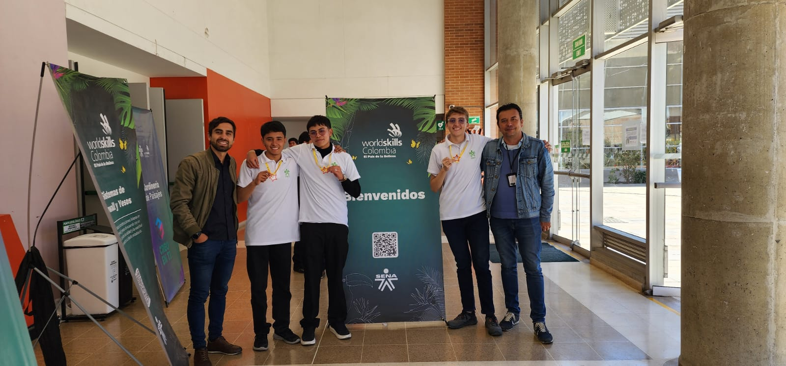
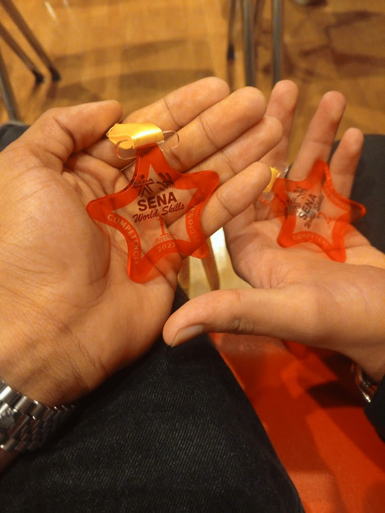
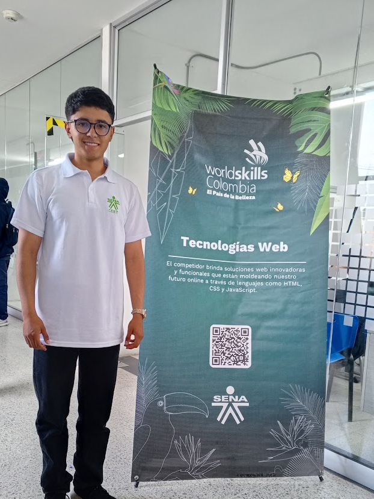

# 🏆 WorldSkills Bogotá 2025 – Desarrollo Web

Este repositorio reúne todo el trabajo que desarrollé durante mi participación en la **competencia WorldSkills Bogotá 2025**, en la habilidad de **Desarrollo Web**, donde obtuve el **primer lugar a nivel regional**, representando con orgullo al **CEET (Centro de Electricidad, Electrónica y Telecomunicaciones)** del **SENA**.

Esta categoría fue la que reunió **el mayor número de participantes en toda la competencia regional**, lo que la hizo aún más desafiante y competitiva.

Aquí encontrarás todas las **tareas entregadas**, los **recursos utilizados** y los **proyectos desarrollados**, acompañados de un enfoque técnico riguroso, disciplina constante y soluciones optimizadas que me permitieron destacar en el proceso.



---

## 📚 Tabla de Contenidos

-   [🏅 Evidencia de Logros](#evidencia-de-logros)
-   [🏆 ¿Qué son las WorldSkills?](#qué-son-las-worldskills)
-   [📁 Estructura del Repositorio](#estructura-del-repositorio)
-   [🎯 Módulos de Competencia](#módulos-de-competencia)
-   [📬 Contacto](#contacto)

---

## 🏅 Evidencia de Logros

<div align="center">



*Medalla de primer puesto obtenida en la competencia regional*



*Durante la ejecución de las pruebas técnicas*


*Ceremonia de premiación y reconocimiento*

</div>

---

## 🏆 ¿Qué son las WorldSkills?

**WorldSkills** es una organización internacional dedicada a promover la excelencia y el reconocimiento de las habilidades técnicas y tecnológicas a través de competencias de alto nivel.

A nivel regional, nacional e internacional, estas competencias simulan entornos reales de trabajo donde los participantes deben demostrar su dominio técnico, su capacidad de adaptación y su criterio profesional bajo condiciones de presión y tiempos limitados.

Participar en WorldSkills implica más que resolver ejercicios: es enfrentarse a estándares internacionales, demostrar preparación, y adaptarse a las exigencias reales del sector productivo.

### ¿Por qué es importante?

- Eleva los estándares de calidad en la **educación técnica y tecnológica**.
- Conecta el **talento joven** con las necesidades actuales de la industria.
- Establece **referentes globales** de desempeño profesional.
- Impulsa la innovación, la disciplina y el crecimiento personal y profesional.

---

## 📁 Estructura del Repositorio

```bash
worldskills-regional-2026/
├── dia-01/                                         # Día 1: Módulo A - Desarrollo Frontend
│   ├── PROYECTO PRUEBA_MODULO_A_HABILIDAD_17.pdf   # Documento oficial con los requerimientos del módulo A
│   ├── TASK 1/                                     # Lógica básica con JavaScript (variables, funciones, condicionales)
│   ├── TASK 2/                                     # Manipulación del DOM y eventos en JavaScript
│   ├── TASK 3/                                     # Estructura básica con HTML semántico
│   ├── TASK 4/                                     # Formularios y etiquetas avanzadas en HTML
│   ├── TASK 5/                                     # Introducción a estilos con CSS básico
│   ├── TASK 6/                                     # Selectores avanzados, pseudoclases y flexbox
│   ├── TASK 7/                                     # Diseño responsivo con media queries
│   ├── TASK 8/                                     # Animaciones con CSS (keyframes, transitions)
│   └── TASK 9/                                     # Implementación de sprites CSS y optimización de recursos
│
├── dia-02/                                         # Día 2: Módulo B - Desarrollo Backend
│   ├── PROYECTO PRUEBA_MODULO_B_HABILIDAD_17.pdf   # Documento oficial con los requerimientos del módulo B
│   ├── proyecto/                                   # Proyecto completo backend con Laravel (API, autenticación, vistas)
│   └── recursos/                                   # Archivos de soporte utilizados durante el desarrollo
│       ├── banderas/                               # Imágenes de banderas para funcionalidades relacionadas con países
│       ├── iconos/                                 # Iconos SVG o PNG utilizados en la interfaz
│       └── estilos.json                            # Archivo de configuración para colores y temas del sistema
│
└── README.md                                       # Archivo principal de documentación del repositorio
```

---

## 🎯 Módulos de Competencia

### Módulo A - Desarrollo Frontend (Día 1)

Este módulo se enfoca en las habilidades fundamentales de desarrollo web frontend:

-   **TASK 1-2**: JavaScript básico e intermedio
-   **TASK 3-4**: HTML básico e intermedio
-   **TASK 5-6**: CSS básico e intermedio
-   **TASK 7**: Diseño responsivo y maquetación
-   **TASK 8**: Animaciones CSS avanzadas
-   **TASK 9**: Sprites CSS y optimización de imágenes

[Ver Módulo](./dia-01/README.md)

### Módulo B - Desarrollo Backend (Día 2)

Este módulo evalúa las competencias en desarrollo backend y full-stack:

-   **Aplicación Laravel**: Framework PHP moderno
-   **Base de Datos**: Migraciones y modelos Eloquent
-   **API REST**: Endpoints para gestión de datos
-   **Frontend React**: Componentes interactivos

[Ver Módulo](./dia-02/README.md)

---

## 📬 Contacto

Para preguntas, soporte o colaboración, por favor contacta:

-   Andrés Gutiérrez Hurtado
-   Correo: [andres52885241@gmail.com](mailto:andres52885241@gmail.com)
-   LinkedIn: [Andrés Gutiérrez](https://www.linkedin.com/in/andr%C3%A9s-guti%C3%A9rrez-hurtado-25946728b/)
-   GitHub: [@AndresGutierrezHurtado](https://github.com/AndresGutierrezHurtado)
-   Portafolio: [Link portafolio](https://andres-portfolio-b4dv.onrender.com)
