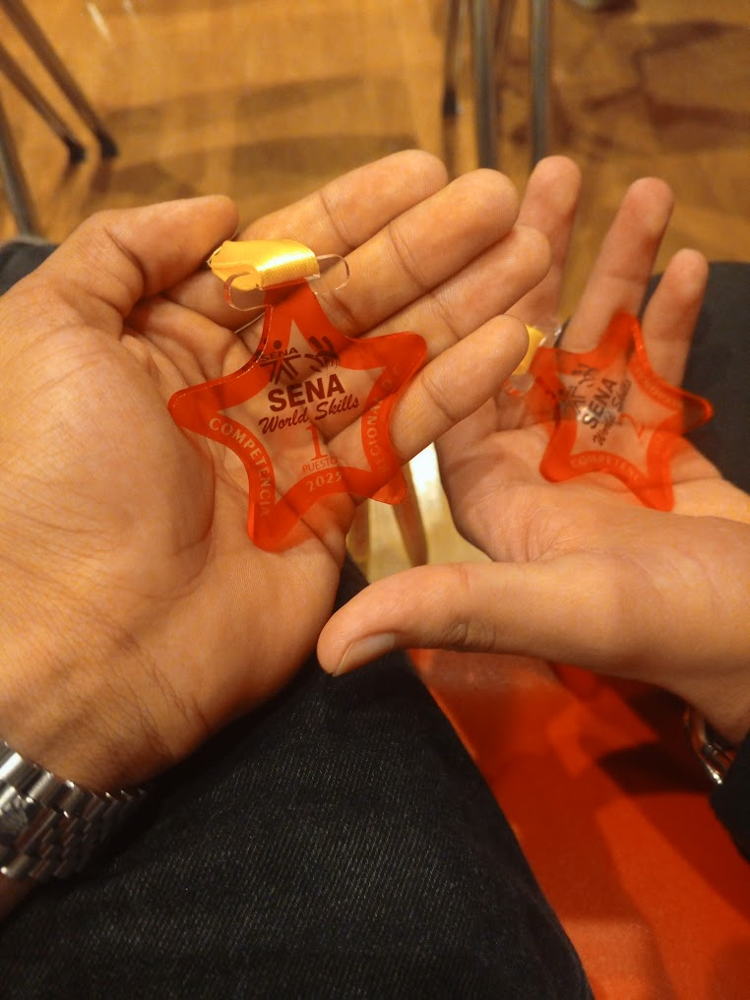
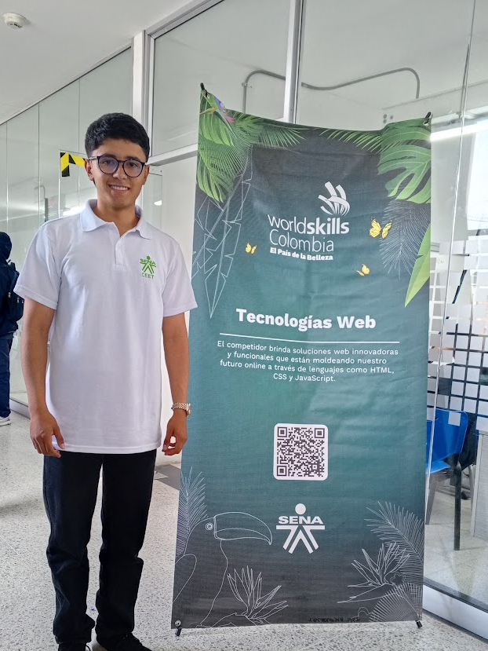

# 🏆 WorldSkills Bogotá 2025 – 🏅 Oro Regional en Tecnologías Web

[🥈 Ver Siguiente competencia (Preselección)](https://github.com/AndresGutierrezHurtado/worldskills-preseleccion-2025)

Este repositorio reúne todo el trabajo que desarrollé durante mi participación en la **competencia WorldSkills Bogotá 2025**, en la habilidad **17 - Tecnologías Web**, donde obtuve el **primer lugar a nivel regional**, representando con orgullo al **CEET (Centro de Electricidad, Electrónica y Telecomunicaciones)** del **SENA**.

Esta categoría fue la que reunió **el mayor número de participantes en toda la competencia regional**, lo que la hizo aún más desafiante y competitiva.

Aquí encontrarás todas las **tareas entregadas**, los **recursos utilizados** y los **proyectos desarrollados**, acompañados de un enfoque técnico riguroso, disciplina constante y soluciones optimizadas que me permitieron destacar en el proceso.

<div align="center">


</div>


---

## 📚 Tabla de Contenidos

-   [🏅 Evidencia de Logros](#-evidencia-de-logros)
-   [🏆 ¿Qué son las WorldSkills?](#-qué-son-las-worldskills)
-   [📁 Estructura del Repositorio](#-estructura-del-repositorio)
-   [🎯 Módulos de Competencia](#-módulos-de-competencia)
-   [📬 Contacto](#-contacto)

---

## 🏅 Evidencia de Logros

<div align="center">



_Medalla de primer puesto obtenida en la competencia regional_



_Durante la ejecución de las pruebas técnicas_


_Ceremonia de premiación y reconocimiento_

</div>

---

## 📁 Estructura del Repositorio

```bash
worldskills-regional-2026/
├── docs/                           # Documentacion e información de la competencia
│
├── modulo-a/                       # Módulo A - Desarrollo Frontend
├── modulo-b/                       # Módulo B - Desarrollo Backend
│
└── README.md                       # Documentación principal del repositorio
```

---

## 🎯 Módulos de Competencia

Los módulos se desarrollaron a lo largo de **dos días**, con una duración de **cuatro horas por módulo**.  

Durante cada jornada, se permitió un máximo de **cinco minutos de acceso a Internet**, sin importar la cantidad de consultas realizadas.

### Módulo A – Desarrollo Frontend (40%)

Este módulo evaluó las **habilidades fundamentales del desarrollo web del lado del cliente**, abarcando desde la **manipulación del DOM con JavaScript**, la **estructura semántica mediante HTML5** y el **diseño visual con CSS3**, hasta conceptos más avanzados como el **diseño responsivo**, las **animaciones fluidas** y la **optimización de recursos mediante sprites en CSS**.  

[Ver detalles de la prueba](./modulo-a/README.md)

### Módulo B – Desarrollo FullStack (50%)

Este módulo midió las **competencias en desarrollo backend y full stack**, con énfasis en la construcción de **aplicaciones web completas** utilizando tecnologías modernas y buenas prácticas de arquitectura de software.  

[Ver detalles de la prueba](./modulo-b/README.md)

### Pitch (10%)

Se llevó a cabo una **presentación final (pitch)** basada en el proyecto del **Módulo B**, en la cual se expuso la **problemática identificada**, la **solución implementada**, el **factor diferenciador** y los **pasos a futuro**.  

Aunque inicialmente me sentí algo **tenso corporalmente**, logré ofrecer una **explicación clara**, lo que me permitió **obtener la puntuación máxima (10 puntos)**.

---

## 📬 Contacto

Para preguntas, soporte o colaboración, por favor contacta:

-   Andrés Gutiérrez Hurtado
-   Correo: [andres52885241@gmail.com](mailto:andres52885241@gmail.com)
-   LinkedIn: [Andrés Gutiérrez](https://www.linkedin.com/in/andr%C3%A9s-guti%C3%A9rrez-hurtado-25946728b/)
-   GitHub: [@AndresGutierrezHurtado](https://github.com/AndresGutierrezHurtado)
-   Portafolio: [Link portafolio](https://andres-portfolio-b4dv.onrender.com)
