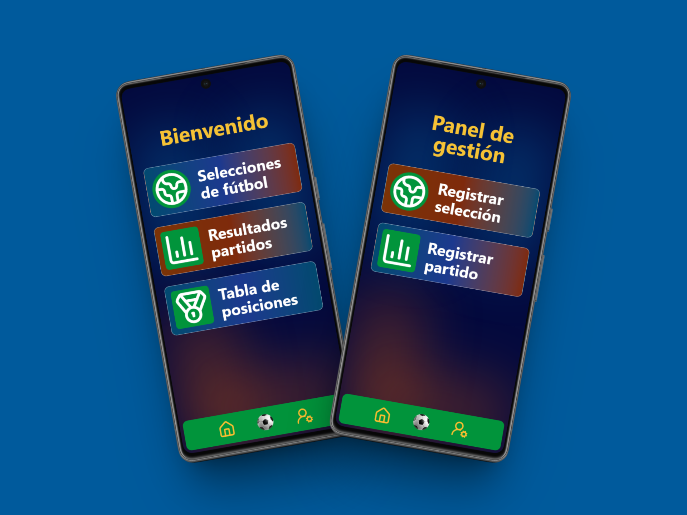
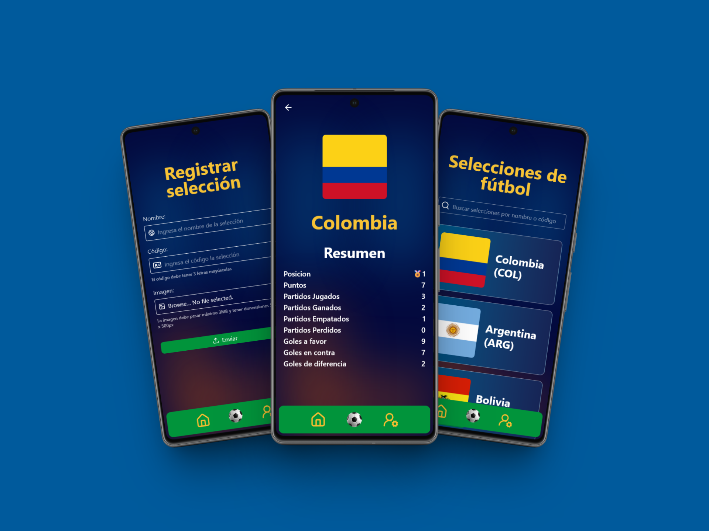
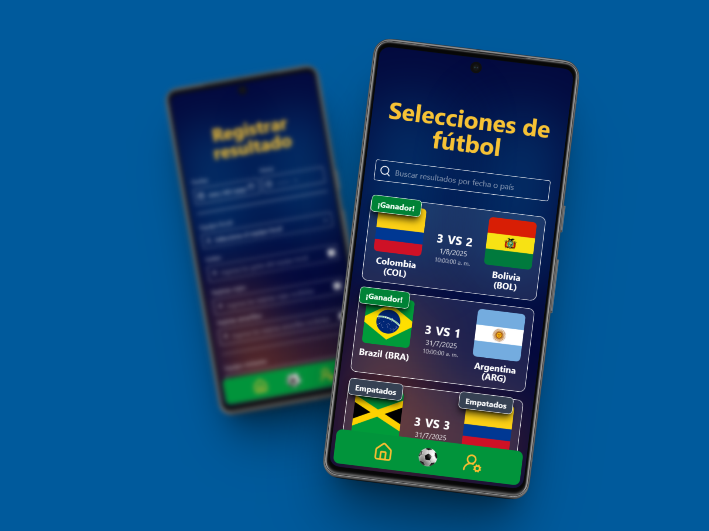
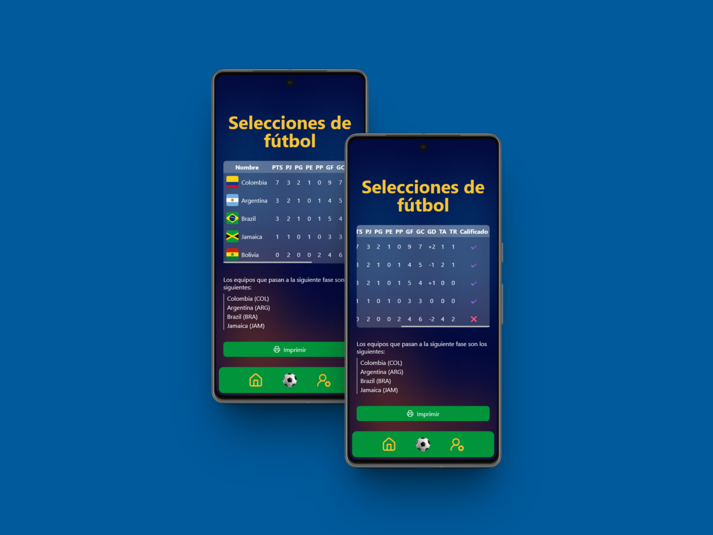

# ⚽ Sistema de Gestión de Selecciones y Partidos

Este proyecto es una aplicación web completa desarrollada para gestionar selecciones de fútbol y sus partidos. El sistema permite visualizar, filtrar y administrar información detallada sobre selecciones nacionales, partidos y estadísticas, proporcionando una interfaz moderna e intuitiva para la gestión de datos deportivos.

<div align="center">


_Sistema web full-stack desarrollado para la competencia WorldSkills Bogotá 2025_

</div>

---

## 🚀 Funcionalidades Principales

### Menu Principal y de Administrador

-   **Dashboard Principal**: Vista general del sistema
-   **Navegación Intuitiva**: Acceso rápido a todas las funcionalidades



_Dashboard principal del sistema de gestión_

### Gestión de Selecciones

-   **Lista de Selecciones**: Visualización completa de todas las selecciones
-   **Filtros de Búsqueda**: Búsqueda por nombre
-   **Información Detallada**: Estadísticas completas de cada selección
-   **Registro de Nuevas**: Formulario para agregar nuevas selecciones



_Interfaz de gestión de selecciones con filtros y búsqueda_

### Gestión de Partidos

-   **Lista de Partidos**: Visualización de todos los encuentros
-   **Filtros Avanzados**: Búsqueda por fecha, equipos
-   **Registro de Partidos**: Formulario para agregar nuevos encuentros



_Vista de resultados y gestión de partidos_

### Top de Posiciones

-   **Ranking Global**: Posiciones de todas las selecciones
-   **Filtros por Período**: Rankings por diferentes temporadas
-   **Métricas Múltiples**: Puntos, goles, partidos jugados



_Ranking de selecciones con estadísticas detalladas_

---

## 🛠️ Tecnologías Utilizadas

### Backend

-   **Laravel Framework** (^12.0) - Framework PHP principal
-   **PHP** (^8.2) - Lenguaje de programación backend
-   **MariaDB** (10.6+) - Base de datos relacional
-   **Laravel Sanctum** (^4.0) - Autenticación API
-   **Laravel Tinker** (^2.10.1) - REPL para Laravel
-   **Eloquent ORM** - Mapeo objeto-relacional
-   **Artisan CLI** - Herramientas de desarrollo

### Frontend

-   **React** (^19.1.1) - Biblioteca de componentes
-   **React DOM** (^19.1.1) - Renderizado de React
-   **React Router DOM** (^7.7.1) - Navegación SPA
-   **TailwindCSS** (^4.0.0) - Framework de estilos
-   **Lucide React** (^0.534.0) - Iconos modernos
-   **SweetAlert2** (^11.22.2) - Alertas y modales

### Herramientas de Desarrollo

-   **Vite** (^7.0.4) - Build tool moderno
-   **@vitejs/plugin-react** (^4.7.0) - Plugin React para Vite
-   **Laravel Vite Plugin** (^2.0.0) - Integración Laravel-Vite
-   **Axios** (^1.8.2) - Cliente HTTP
-   **Concurrently** (^9.0.1) - Ejecución paralela de comandos
-   **Composer** - Gestión de dependencias PHP
-   **npm** - Gestión de dependencias JavaScript
-   **Git** - Control de versiones

---

## 📁 Estructura del Proyecto

```
proyecto/
├── app/
│   ├── Http/
│   │   └── Controllers/         # Controladores de la API
│   ├── Models/                  # Modelos Eloquent
│   │   ├── Play.php             # Modelo de Partidos (plays)
│   │   ├── PlayTeam.php         # Modelo de Equipos en Partidos (play_teams)
│   │   └── Team.php             # Modelo de Selecciones (teams)
│   └── Providers/               # Proveedores de servicios
├── database/
│   ├── migrations/              # Migraciones de base de datos
│   ├── seeders/                 # Datos de prueba
│   └── factories/               # Factories para datos
├── resources/
│   ├── js/                      # Componentes React
│   │   ├── components/          # Componentes reutilizables
│   │   ├── pages/               # Páginas de la aplicación
│   │   ├── layouts/             # Layouts principales
│   │   └── hooks/               # Custom hooks
│   └── views/                   # Vistas Blade (si aplica)
├── routes/
│   ├── api.php                  # Rutas de la API
│   └── web.php                  # Rutas web
├── public/
│   └── recursos/                # Recursos estáticos
│       ├── banderas/            # Imágenes de banderas
│       ├── iconos/              # Iconos SVG/PNG
│       └── estilos.json         # Configuración de estilos
└── config/                      # Configuraciones de Laravel
```

---

## 🗄️ Base de Datos

### Estructura Principal

#### Tabla `teams` (Selecciones)

-   `team_id`: Identificador único (Primary Key)
-   `team_name`: Nombre de la selección
-   `team_code`: Código de la selección (ej: ARG, BRA, COL)
-   `team_flag`: URL de la bandera de la selección

#### Tabla `plays` (Partidos)

-   `play_id`: Identificador único (Primary Key)
-   `play_date`: Fecha del partido
-   `play_start`: Hora de inicio del partido

#### Tabla `play_teams` (Relación Partidos-Equipos)

-   `team_id`: ID del equipo (Foreign Key → teams.team_id)
-   `play_id`: ID del partido (Foreign Key → plays.play_id)
-   `team_goals`: Goles anotados por el equipo en el partido
-   `team_local`: Boolean que indica si el equipo es local (true) o visitante (false)
-   `team_red`: Número de tarjetas rojas del equipo
-   `team_yellow`: Número de tarjetas amarillas del equipo

---

## 🔌 API Endpoints

### Selecciones

```
GET    /api/teams              # Listar todas las selecciones
GET    /api/teams/ranking      # Obtener selecciones con estadísticas
GET    /api/teams/{id}         # Obtener selección específica
POST   /api/teams              # Crear nueva selección
```

### Partidos

```
GET    /api/plays              # Listar todos los partidos
POST   /api/plays              # Crear nuevo partido
```

---

## 🔧 Instalación y Configuración

### Requisitos Previos

-   PHP 8.2 o superior
-   Composer 2.8.1
-   Node.js 22.11.0
-   MySQL 8.2.12
-   Git

### Pasos de Instalación

1. **Clonar el repositorio**

    ```bash
    git clone https://github.com/AndresGutierrezHurtado/worldskills-regional-2026.git
    cd worldskills-regional-2026/dia-02/proyecto
    ```

2. **Instalar dependencias PHP**

    ```bash
    composer install
    ```

3. **Instalar dependencias JavaScript**

    ```bash
    npm install
    ```

4. **Configurar variables de entorno**

    ```bash
    cp .env.example .env
    php artisan key:generate
    ```

5. **Configurar base de datos en `.env`**

    ```env
    DB_CONNECTION=mysql
    DB_HOST=127.0.0.1
    DB_PORT=3306
    DB_DATABASE=copa_america_db
    DB_USERNAME=root
    DB_PASSWORD=
    ```

    > **Nota**: Aunque la configuración usa `mysql` como conexión, es compatible con MariaDB 10.6+

6. **Ejecutar migraciones y semillas**

    ```bash
    php artisan migrate --seed
    ```

7. **Compilar assets**

    ```bash
    npm run build
    ```

8. **Iniciar servidor de desarrollo**
    ```bash
    php artisan serve
    ```
